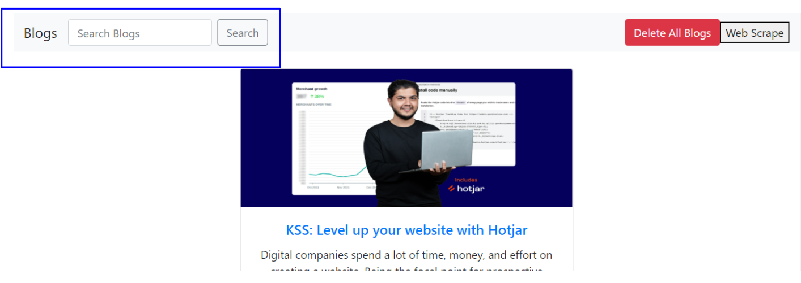
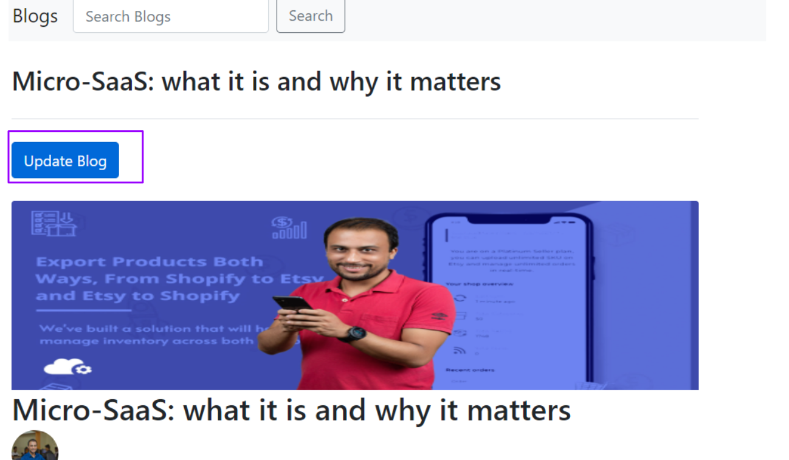
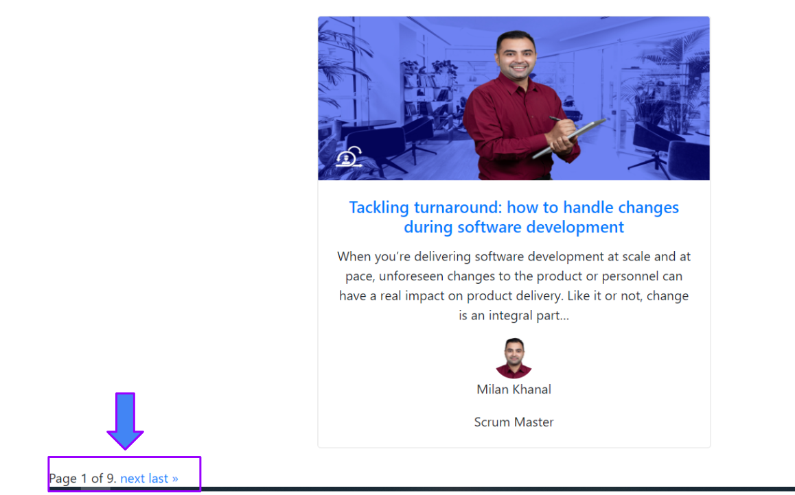
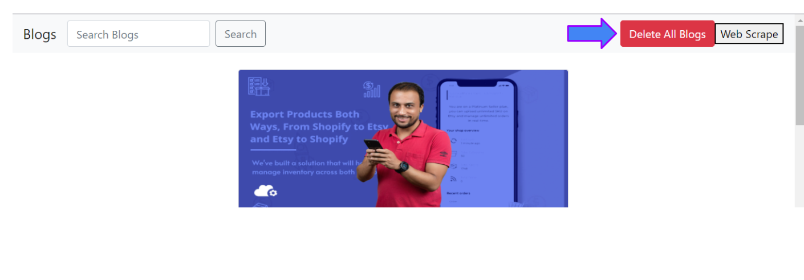
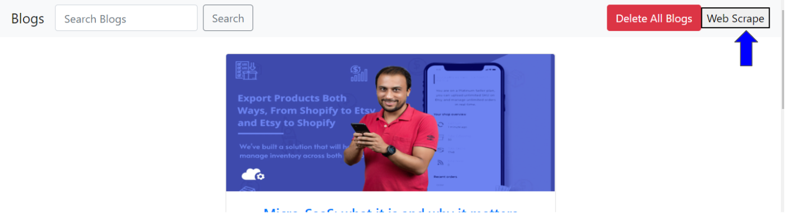

# django-blog-app
Web App to scrape the blogs and store it in database. User can view and update the blogs store in the database

## Quick start

Follow the instruction to run this Django App in your local machine.

### Using the docker-compose
1. Clone the repo 

`https://github.com/prabaldeshar/django-blog-app.git`

2. Go the the directory website

`cd website`

3. Run the docker compose command

`sudo docker-compose up`

4. Connect to the Django app from your browser in the port 8000.

`http://localhost:8000/`

## How it works

After running the server then you can connect to site at `http://localhost:8000`. 
Here you find the blogs that are scraped for the [Proshore's Resources](https://proshore.eu/resources/). 

You can click on the blogs to read the details about the blogs.

You can search for the blogs using the serach box in the navbar.

You can update the description and title of the blog using the update button on the top o the detail page.

You can also go to the next page using the Pagination section at the bottom on the blogs page.

If you want to clear all the blogs in the database you can use the `Delete All Blogs` button at the right hand side of the Navigation Bar.

After clearing all the blogs from the database. You can again retrive all the blogs from the Proshore's website using the `Web Scrape` button. This button retrives all the blogs from the [Proshore's Resources](https://proshore.eu/resources/) site and add them to the database. Since, it is retreving the data from the internet, it might take a while to retrieve all the data.

